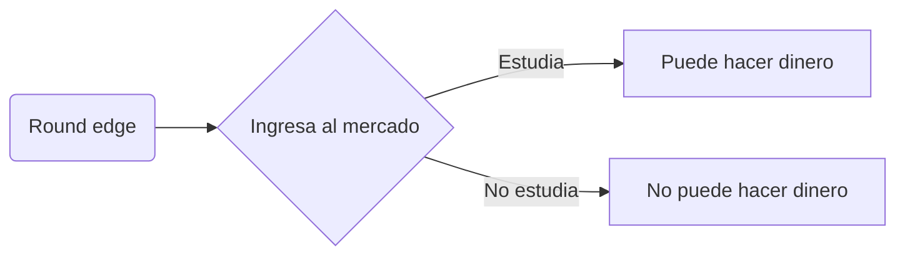

# Despedida del autor

Al elegir dónde ubicarme en el mundo descubrí que solo disfrutamos al olvidarnos del dinero y el tiempo en cada una de nuestras experiencias.

Suena imposible pero en realidad así somos desde nuestra propia naturaleza.

Y solo vi algo tan evidente al conocer la otra vereda, porque trabajé la mayor parte de mi vida como empleado, cumpliendo algunas órdenes absurdas y sin posibilidades reales de desarrollo.

| Empleado                     | Trader { class="compact" }   |
| ---------------------------- | ---------------------------- |
| Me decían qué hacer          | Elijo qué hacer              |
| Tenía poco tiempo            | Tengo todo el tiempo         |
| Dinero limitado              | Dinero ilimitado             |
| Estrés, cansancio, _burnout_ | Equilibrio, fuerza, gratitud |

Muchas veces me dijeron en distintos rubros y empresas que no haga cosas que para mí tenían mucho sentido.

Entonces **cuando empecé a hacer lo que para mí tiene sentido, sin cumplir más órdenes de nadie, empezó realmente mi vida.**

Antes recibía un salario limitado de dinero, que me alcanzaba para pasar tres semanas de vacaciones (con tantos lugares para conocer en tan poco tiempo, nunca sentí haber tenido vacaciones)...

Me permitían apenas una o dos horas realmente libres por día, salvo en mi franco o el fin de semana, donde muchas veces cumplía trámites porque usaba mucho servicios de empresas y bancos que siempre tenían problemas.

Con el trading y acercando mi curso al mundo recibo y recibiré una suma incalculable de dinero (no un salario limitado)...

Y tengo todo el tiempo libre que quiera, porque al gestionar el capital de manera directa ya no necesito producir dinero porque sí.

### Tienes dos caminos

Y no solamente lo menciono yo, ni la biblioteca de trading que estudié, sino la comunidad de Criptonautas desde su experiencia directa y colectiva.

!!! info

Puedes revisar todo lo que hacemos desde hace casi 3 años y verificar cómo fue el desarrollo de cada integrante que se sumó porque todo lo que hacemos es público (o reservado a quienes demuestren cierto compromiso).

!!!

## Siempre podemos elegir

> _Este camino no es ni será simple, pero tampoco lo es el tradicional que te impusieron o auto-impusiste._

Soy **matenauta** en Discord, la comunidad o el blog de Criptonautas.

Y mezclo música electrónica como **Matías Isea** _(aprendí trading para poder mezclar tranquilo y sin limitaciones)_.

No tengo títulos y soy un cartoon. Pero además de tradear en cripto \~7 años, diagramo, administro, gestiono y desarrollo Criptonautas.

Parece que así somos los humanos cuando valoramos nuestra libertad :)

## Namaste 🙏
