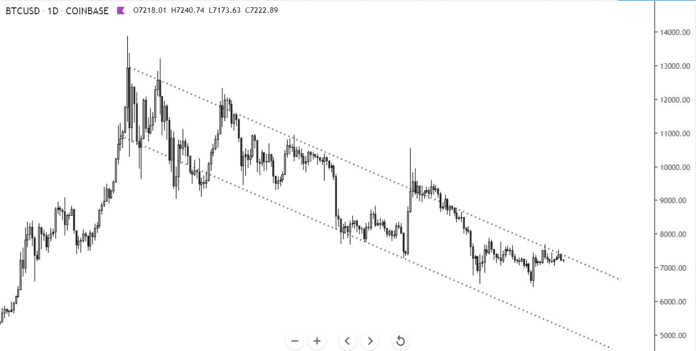
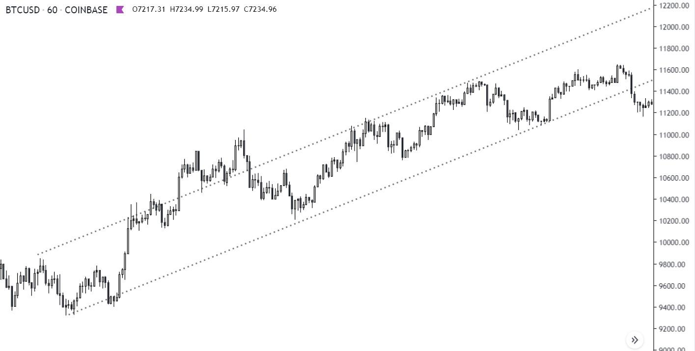
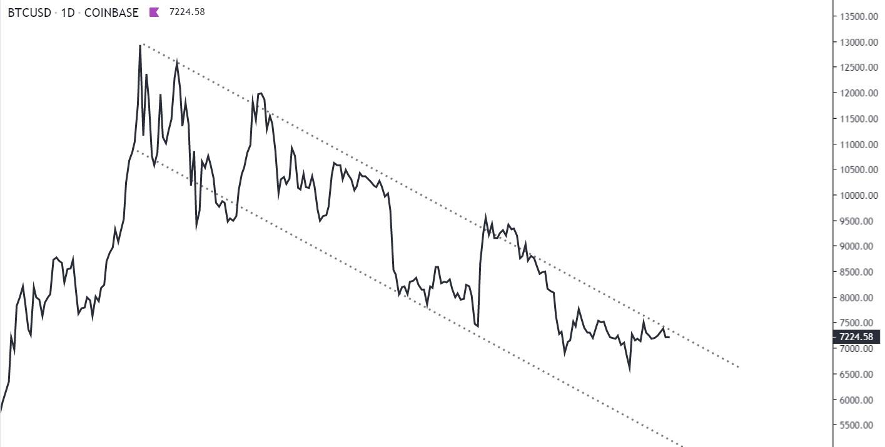
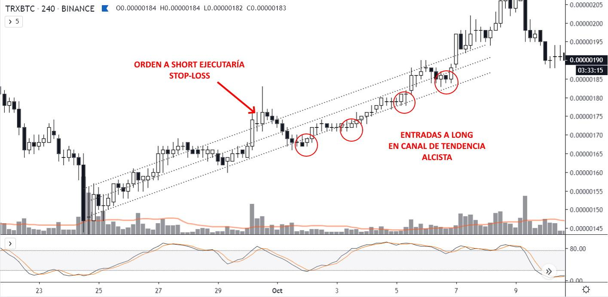

# Operando tendencias

Operar en laterales nos ofrece trades a long y a short, por eso es el momento perfecto para hacer scalping y sumar margen.

Esa es mi estrategia por excelencia, la más simple que encontré y la más rentable y sostenible.

Pero por algún motivo que aún no conocemos, la mayoría solo opera tendencias, casi de manera instintiva.

La estrategia se puede adaptar, teniendo en cuenta una particularidad.

**Al operar tendencias, solo acompañaremos el movimiento principal.**

Los canales de tendencias se forman cuando el precio toca o se acerca lo suficiente, **al menos 2 (DOS) veces**, a las líneas del mismo.

> **TIP:** traza los canales en líneas (en vez de velas) al momento de pintar tus gráficos.

Así evitás el ruido del precio en latigazos que se generan por falta de volumen, liquidación de posiciones apalancadas o compradores random que se equivocaron en la orden.

### Solo hay que ir con la tendencia

* En canales de tendencia ALCISTA, deberías buscar órdenes a LONG. Genial si son swings!
* En canales de tendencia BAJISTA, órdenes a SHORT. Pueden ser swings!
* En laterales ambas, y cuando no hay tantos movimientos, hacer scalping.

Intentar órdenes en sentido contrario implica mayores probabilidades de que se den los _stop-loss_ porque la presión tendencial es más probable.

Y la extensión de las tendencias al alza es mayor, por eso solo debemos cubrirnos en la temporada bear, los apodados por youtubers bros como cripto-inviernos.

También podemos shortear, pero lo más importante es conservar el capital. **De nada sirve si **_**ganas**_** algo que se devalúa o se va a cero.**

Es más rentable acompañar la tendencia.

El trade contrario "es más corto" porque la tendencia, justamente es la mayoría en una dirección.

**Nuestro AT incorpora pocos conceptos porque es minimalista y por eso funciona.**

Recuerda que en períodos laterales, puedes buscar tanto entradas a long como a short porque la presión entre compradores y vendedores es la misma (mientras se respete dicho período).

En canales de tendencia, mejor **IR CON LA TENDENCIA**.
