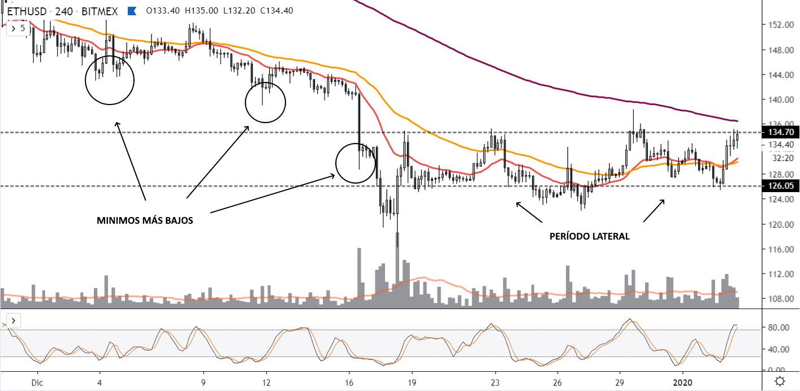
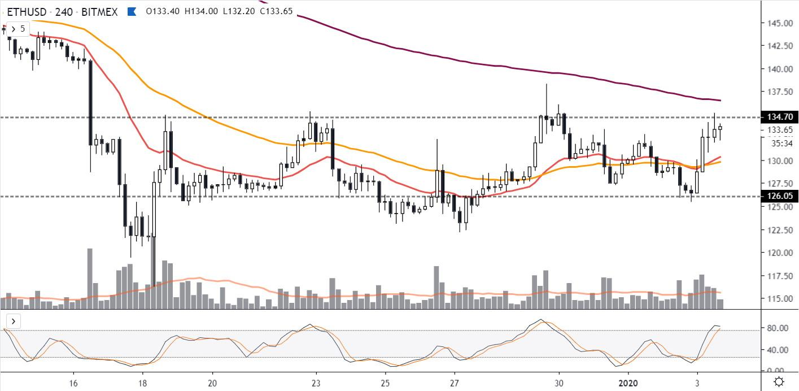
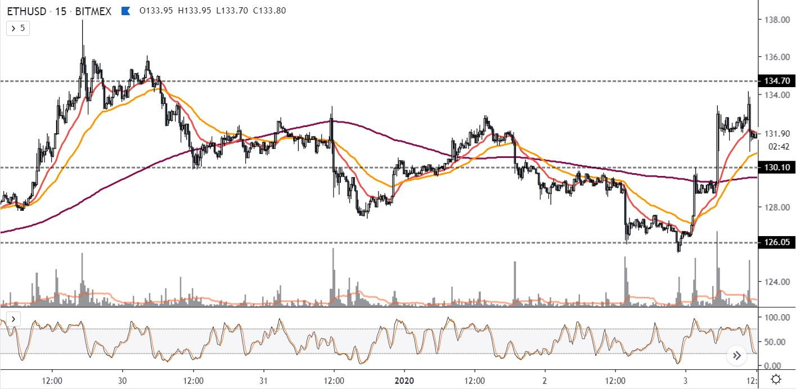

# Operar en laterales

_¿Cuántas personas conoces que están tranquilos cuando el precio de las criptomonedas se mueve poco?_

Los períodos laterales no despiertan **emociones en la mayoría**, porque son predecibles...

Y lo que motiva a las personas en relación al trading es un movimiento brusco y fuerte. Algo que genere millonarios de un día para el otro.

Porque es el nuevo sueño americano, tener una cierta cantidad de millones!

> Me crucé a personas con dos Lamborghinis (reales) y me abrazaron y agradecieron por compartirles que la clave está en lo genuino y simple.\
> \
> Como humanos tenemos existencialmente los mismos retos y desafíos. Y el dinero está muy sobre-valorado por la mayoría, porque lo suele necesitar.

Las chances del golpe de suerte son realmente muy pocas. Y nada escapa a esa premisa.

Lo que tal vez no has pensado aún, es que en eso que la mayoría evita... En esos momentos de calma, en realidad están las mayores oportunidades.

### **Te educan instituciones**

Y por eso te cuesta tanto gestionar tu dinero de manera rentable y sostenible.&#x20;

Aquí nos reseteamos, por eso verás que hacemos cosas cosas que muy pocos imaginan o intentan.

Las empresas y los Estados no quieren que operemos en el mercado sino que compremos y vendamos desde noticias con impacto, donde ellos pueden apretar un botón para hacer dinero.

Venden productos y servicios inútiles en períodos alcistas, y desaparecen en períodos bajistas. Mientras muchos continúen en loop, eso seguirá funcionando.

> **Estás eligiendo lo contrario, regalate tiempo porque es lo más importante que deberás invertir en tu camino.**

Aquí verás al precio corrigiendo a la baja pero luego encontrando un canal lateral, en un gráfico a 4 horas:

Luego de mínimos más bajos, que definen una tendencia bajista, encontramos una zona donde el precio se mantiene.

Conocemos eso como **canal o zona lateral**. Hicimos  un 6% comprado y vendido en un extremo (˜126) y vendiendo en el otro (˜134)!

Eso es hacer trading, y funciona. Es suficiente para hacer dinero desde los gráficos.

> En el próximo capítulo verás que al hacer scalping, hacemos zoom y así podemos elegir el momento preciso (no certero) de nuestra operación.\
> \
> Pero luego verás que puedes aplicar la estrategia donde quieras.

**¿Recuerdas los patrones que leíste antes?**

_Si no los recuerdas, mejor tómate unos minutos para repasarlo:_

[patrones-criptonautas.md](../el-precio-dice-casi-todo/patrones-criptonautas.md "mention")

En ese gráfico, que es el mismo que vimos antes, podemos reconocer los patrones criptonautas para entrar y salir del mercado.

Compramos en un extremo del canal, y vendemos en el otro, donde se respeten esos patrones.

Listo! Esa es la estrategia más simple y probada de trading en la historia.

Luego la vamos a pulir, pero tu práctica ahora es que reconozcas todos los canales laterales que encuentres.

<figure><figcaption>
<a href="https://comunidad.criptonautas.co/t/zonas-laterales-primeras-practicas/762">Empezamos siempre compartiendo</a>
</figcaption></figure>

###

### Esperamos DOS toques en ambas direcciones para un canal lateral

* Si haces scalping, delimitarás la mayoría de tus zonas laterales en temporalidades de 1H o 4H.
* Si haces swing trading, en 1D o 3D (uno o tres días).
* Si eres un inversor buscando entrar y salir de los ciclos mayores del mercado, prestarás más atención a las velas semanales y a fundamentos.

Lo que conocemos como soportes y resistencias no son puntos exactos en las variaciones del precio, por eso hablamos de **niveles de precios**.

> _Cuando te den números exactos desconfía porque es chamuyo._
>
> __\
> _Sobran ejemplos en la farándula Argentina. El mainstream no tiene memoria, las emociones son muy fuertes._

El precio se mueve por niveles, no de manera exacta porque en el trading no hay certezas. Entonces reconocemos zonas.

La zona es variable pero se ve en las figuras que forma el precio en los gráficos, porque el gráfico está representando la psicología de todo el mercado.

Y al mantener las mayores probabilidaes a nuestro favor, hacemos lo que hacen muy pocos. Porque primero estudiamos y practicamos.

Le damos un poco más de _zoom_ al gráfico anterior:

Y ahí ya no estamos en velas de 1 hora sino en 15 minutos y con una línea en el medio del canal lateral.&#x20;

**El precio ofrece resistencia en ese nivel de precios (es un buen punto para tomar ganancias). Tan simple como el medio.**&#x20;

Mi estrategia busca obtener beneficios teniendo en cuenta nuestro capital (recordando que somos mojarras) y, sobre todo, las condiciones actuales del mercado.

Es ultra-especulativo y totalmente experimental. Eso nos permite vivir como queremos, pero también nos puede djar en cero si no practicamos ni compartimos.

##
