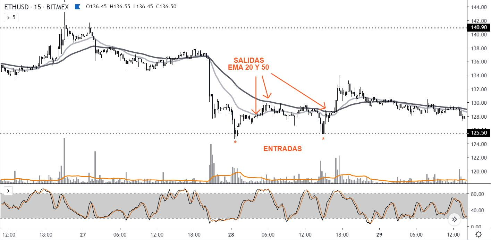
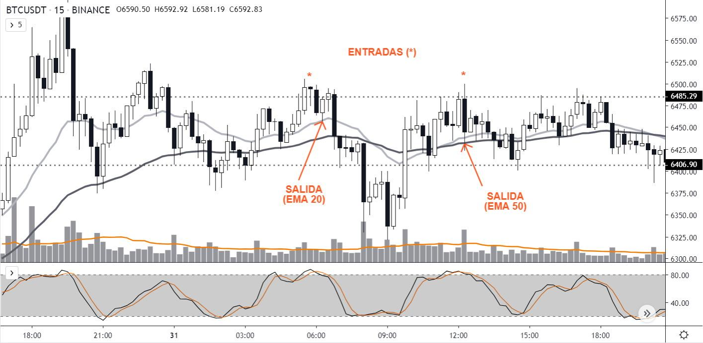
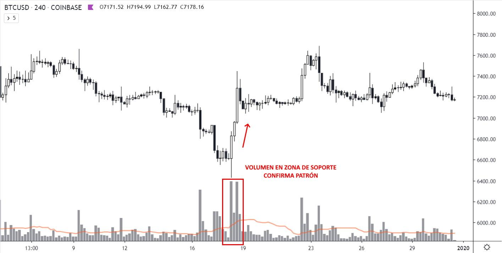
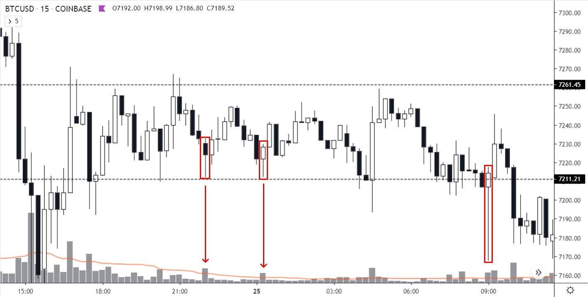
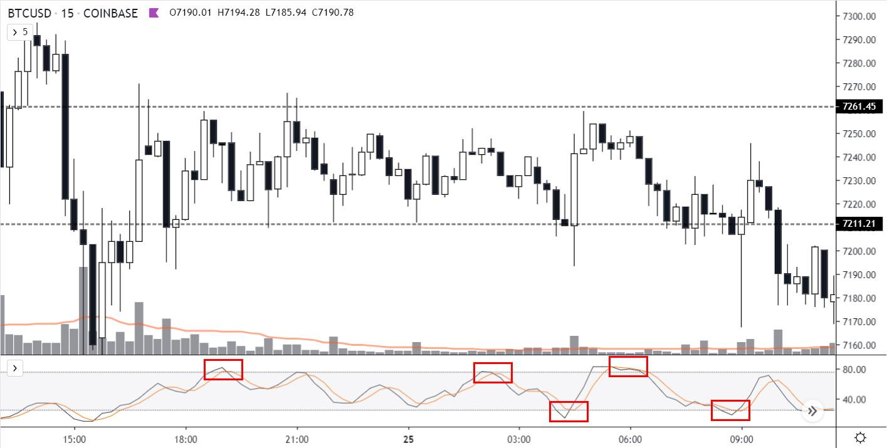
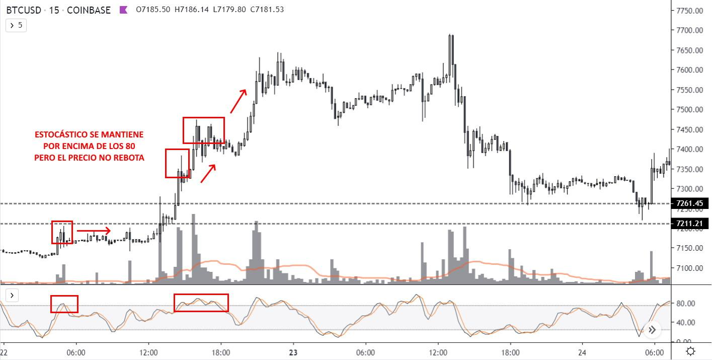
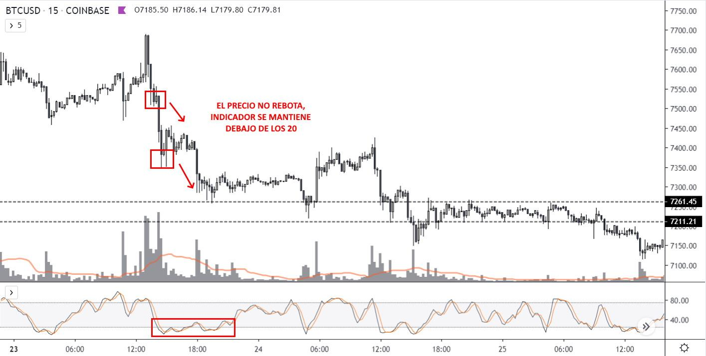

# Cuatro indicadores

Los indicadores pueden acercarnos info sobre cuatro variables que analizamos en nuestros gráficos:

* Volatilidad
* Volumen
* Momentum
* Tendencia

> Ninguno de ellos te ofrecerá mucha info de manera individual, porque debe tener en cuenta al menos las cuatro variables.
>
> Y ningún indicador, puede indicar las cuatro variables a la vez. Por eso somos traders y los complementamos en estrategias/

### El promedio del precio suma

Al hacer scalping usamos las **medias móviles** (promedio del precio) de **20 y 50** períodos en temporalidades de 5M o 15M porque son un buen indicador para la toma de ganancias.

_Al hacer trading intra-day, las aplicamos a 1H o 4H. Lo mismo vale para 1D o 3D al hacer swing trading._

Muchos operadores tenemos en cuenta esas medias móviles en nuestras órdenes, entonces son útiles para definir ciertas acciones.

Pero puedes usar otras, si lo prefieres así. Deberías elegir las exponenciales (EMAs) porque responden más rápido al movimiento del precio.

Aquí las ves en acción:

Tal vez hayas notado que algunos patrones de velas se cumplen más que otros.&#x20;

### Siempre con volumen

Si ves en el gráfico un patrón de velas que indique agotamiento o reversión, con un **volumen mayor** al que muestran las velas anteriores, eso implica un mayor número de compradores y vendedores.

Y eso implica que es más relevante, tiene más chances de concretarse.

### También medimos el impulso

El único indicador que considero puede sumar información al momento de utilizar la estrategia, es el **oscilador estocástico** porque aporta información acerca del _momentum_ y puede ser útil al definir entradas o salidas.

Este indicador mide qué tan fuerte sube o baja el precio de un valor en relación con sus precios habituales para un período determinado (recomiendo que lo dejes en su valor por defecto, 14 períodos). En la práctica, el estocástico indicaría compras o ventas en las siguientes situaciones enmarcadas con rectángulos:

Como podése ver, el cruce de las líneas que componen el indicador sobre su valor 80 (se puede ajustar a 75), indicaría venta en _short_ o toma de ganancias en _long_; mientras que el cruce sobre su valor 20 (ajustable a 25), indicaría compra en _long_, o toma de ganancias en _short_.

Es sencillo y suele complementarse muy bien con la estrategia.

&#x20;

**IMPORTANTE**: muchos novatos operan exclusivamente a partir de la “sobre compra” o “sobre venta” que representan indicadores de _momentum_ (estocástico, RSI, MACD, CCI, Williams %R, etc).

Estos indicadores deben analizarse en conjunto con otros -y SIEMPRE desde price action- porque durante períodos tendenciales, pueden permanecer durante mucho tiempo en “sobre compra” o “sobre venta” y no deben ser tenidos en cuenta. Operar solo a partir de un indicador suele generar pérdidas y no es para nada recomendable:

