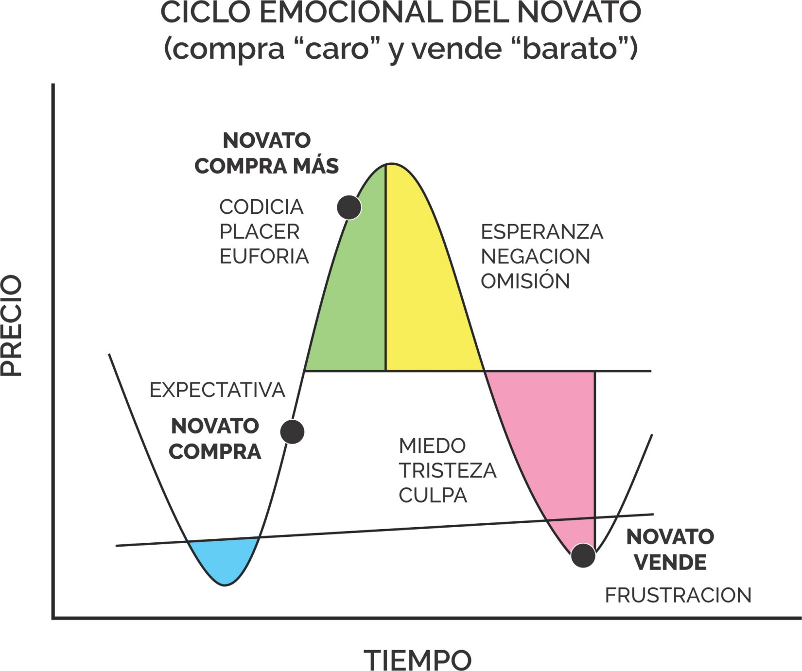

# Nuestra mente no es fiable

!!!

“Logic will get you from A to B. Imagination will take you everywhere.”

⎯ Albert Enstein

!!!

Si lo tengo que expresar en números, aprendí que el éxito en el _trading_ depende un 30% de análisis técnico y un 70% de gestión mental y emocional.

En su momento descreí el valor que la psicología representa al momento de operar.

Suponía que analizando gráficos y fundamentos, combinando varios indicadores, iba a lograr beneficios extraordinarios.

Y que la psicología en el _trading_ solo valía para personas débiles, entre las cuales ilusamente no me incluía.

La realidad me demostró lo contrario: si negamos el valor que tienen las emociones y la psicología al momento de operar, perdemos dinero frente a instituciones y verdaderos _traders_.

**Muy pocos novatos estudian más allá del AT. La mayoría pierde y se retira, o se vuelve adicta (dependiente en exceso) y pierde todo.**

## El análisis técnico no asegura nada a futuro

En el mercado operamos personas o robots programados por personas y por eso, la certeza no existe a la hora de hacer _trading_.

> No cualquiera puede convivir con eso, cuesta abandonar la zona de confort donde nos hacen creer que podemos asegurar nuestro futuro.
>
> Lo siento, pero es físicamente imposible.

Un método de _trading_ no puede prevenir que salgas tarde o de manera prematura de una posición, o que no respetes tu _stop-loss_.

Porque eso dependerá exclusivamente de tus reacciones, que podrás o no desarrolar mental y emocionalmente.

**Lo único que debe motivar tus operaciones es una estrategia de inversión o \_trading**\_\*\* fundada en análisis técnico.\*\*

La esperanza no es objetiva, la intuición puede fallar.

Las probabilidades de que una operación sea exitosa al estar motivada de las emociones, es la misma de que salga cara o cruz al tirar una moneda.

En ese caso no estarías haciendo _trading_ sino apostando.

Y ahí siempre vas a perder, porque tu dinero no es ilimitado y te vas a quedar sin dinero para continuar tirando la moneda.

Eso ubica al 97% del mercado que pierde dinero.

Y prácticamente nadie lo menciona, porque es algo que genera sentimientos muy desagradables: culpa, miedo, baja autoestima, bronca, ira, pena.

Duele mucho y parece más simple intentar negarlo, aunque sea imposible hacerlo.

!!!danger Si no gestionas sentimientos, pensamientos y emociones, repitirás errores cíclicos, y nada ni nadie te podrán sacar de esa situación más que tú mism@. !!!

**Meditar es la práctica por naturaleza del trader criptonauta, pero también observamos lo que nos pasa desde la psicología.**

_Leí muchos libros académicos, que pueden ser aburridos para quienes no tienen tanto interés en la psicología como profesionales o algunos curiosos._

_Por eso menciono lo que vas a encontrar, y te acerco métodos sencillos para que sepas por cómo comenzar a superarlos. Pero puedes evaluar asesoramiento profesional._

### Deberás deschipearte con nosotros

Desde que somos chicos nos enseñaron a ser proactivos, productivos, hacer todo el tiempo cosas, insistir hasta el cansancio o a “no rendirnos jamás”.

Las instituciones (escuela, universidad, trabajo, familia) desarrollan la proactividad al máximo porque es lo que la sociedad del consumo necesita para funcionar como tal.

No necesita _traders_, necesita piezas de engranajes que cumplan funciones específicas.

La _programación mental_ que recibimos socialmente nos lleva a cortar profits al hacer trading y arriesgar en las pérdidas porque nos acostumbran a evitar sentimientos negativos.

**Te irá mejor practicando mucho y operando poco, como si fueras un bateador de béisbol.**

No se trata de comprar y vender todo el tiempo, sino de hacerlo cuando se confirme tu estrategia.

Pasarás mucho tiempo en tu setup, estrategia e incluso disfrutando otras actividades para estar tranquilo/a y tomar decisiones conscientes.

Fijar y respetar un stop-loss equivale a asumir pérdidas y es una acción que no forma parte de nuestra enseñanza cotidiana porque la reacción humana frente al dolor es la negación.

Y a eso le sumamos el adoctrinamiento social.

_Las materias aplazadas en la escuela se recuperan, las historias de amor románticas que se ven en el cine o en las series, son eternas._

En nuestro Universo Criptonauta, estudiamos lo que queremos y nos resulta interesante. Y no nos anclamos a relaciones ni conceptos que no nos resulten agradables.

Adoptar el verdadero trabajo de un _trader_, no es algo que se consigue leyendo. Cambios en estructuras tan fuertes de pensamiento requieren entrenamiento.

Y por eso deberás practicar, compartiendo. Piensa que estás en la escuela y aprendemos entre todos.

||| Criptonautip 3 Si te interesa tu trading puedes sumar a tu vida todo lo que sientas que aporta a tu salud mental y emocional.

Artes marciales, meditación, yoga, programación neurolingüística, hipnosis, ejercicio y _tapping_ (EFT), salir a caminar, escuchar música, pintar, dibujar, lo que se te ocurra estará bien. |||
