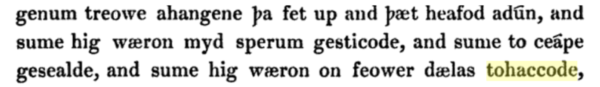

# Hackeamos nuestra mente

## ¿Qué entiendes por hacking?

La mayoría relaciona al _hacking_ con vándalos y terroristas, pero lo mismo pasa cuando esa misma mayoría piensa en techno, rock, Bitcoin, Monero y cualquier cosa que no se manifieste a favor de instituciones.

Como habrás notado, no nos detemos demasiado en los nombres técnicos de las cosas porque interpretamos que no tiene sentido hacerlo. Hablamos varios idiomas, y lo relevante se genera a nivel conceptual.

Nos gusta averiguar la etimología de las palabras, porque eso nos devuelve los orígenes.

La palabra hack significa antiguamente cortar con un hacha. Y puedes relacionar esto con vikingos y guerras, pero también con **algo que se rompe para no volver a ser lo mismo.**

<figure><figcaption>
<a href="https://blog.deepgram.com/the-history-of-the-word-hacker-2/">The history of word hack</a>
</figcaption></figure>

Dando vueltas sobre el concepto y filosofando durante casi tres meses, entiendo que todos podemos romper nuestra realidad y la mayoría de las cosas instaladas.

Y de eso se trata hackear para un Criptonauta: romper la realidad que no aceptamos. Esto no necesariamente tiene que ser violento, los niños rompen todo el tiempo sin violencia.
