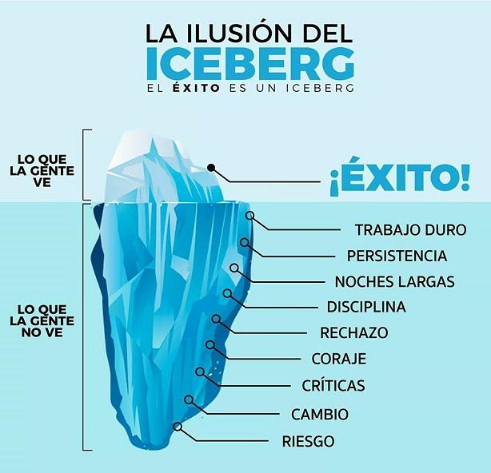

# HACK 2: reconoce tu camino

El trading rentable y sostenible **requiere** de un largo camino de frustraciones, riesgos, cambios, persistencia y superación personal.

La mayoría solo pretende el éxito y sin esfuerzo porque solo ve _la punta del iceberg_, sin tener idea de todo lo que hay detrás _o por debajo_.

Disfruto muchísimo mantener una vida de la que no necesito escapar, y poder ocupar el tiempo con _hobbies_ o las personas que aprecio, sin tener que pedirle permiso a nadie.

Hoy puedo mirar hacia atrás en perspectiva, entiendo y le encuentro sentido a cada una de las caídas que tuve que superar en mis años como _trader_.

La frase está _clicheada_ pero tiene sentido: “Lo que no mata, fortalece” (Frida Kahlo).
